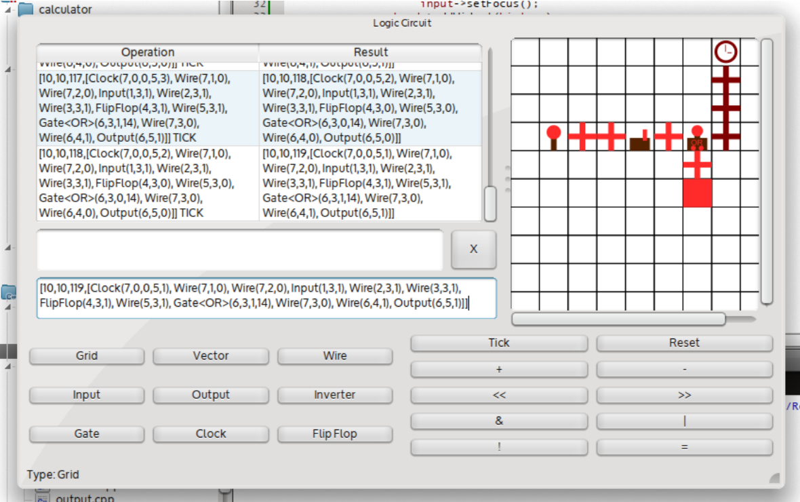

# redstone-calculator

An old project I found in an old backup, done for an exam @ unipd.

The assignment was to just "Build a calculator" on any custom types.

Given everything can be seen as a calculator (if you squeeze your eyes a little), I decided to see how far could I bring the calculator concept and decided to create a calculator between boards made of logic gates inspired by [Minecraft](https://minecraft.gamepedia.com/Mechanics/Redstone/Logic_circuit).

This "calculator" is a C++ Qt application and it's able to handle a ticking simulation made of Input emitters, Output receivers, Clocks, FlipFlops, Inverters, AND, NAND, OR, NOR, XOR, XNOR gates.
